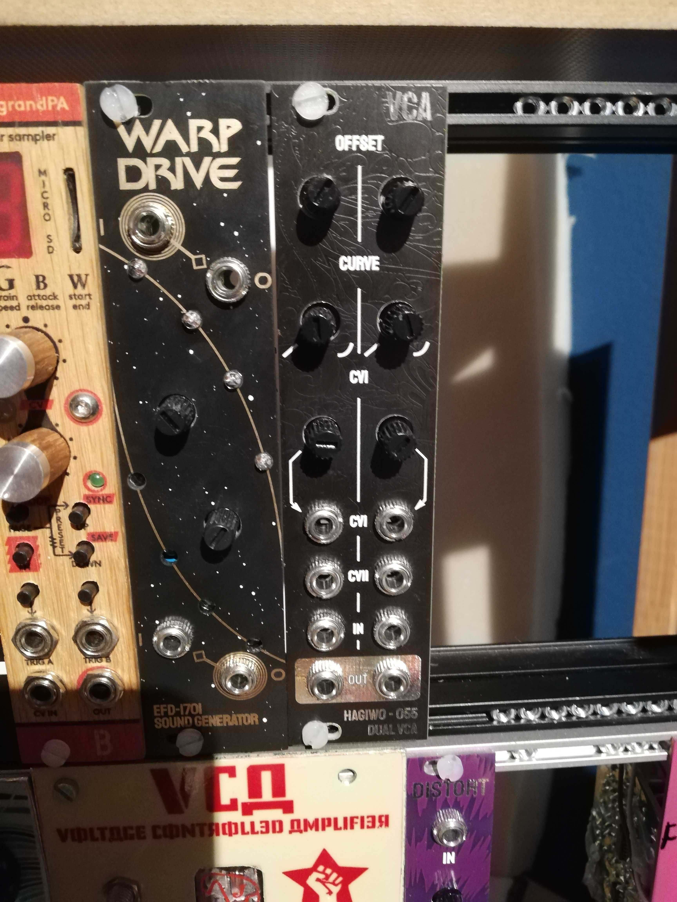
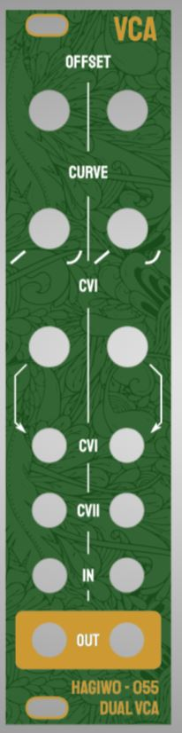
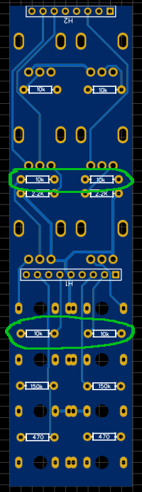
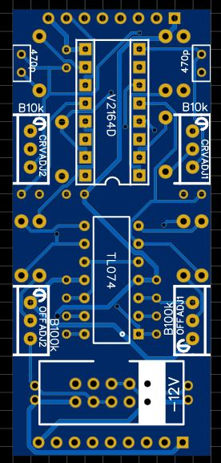
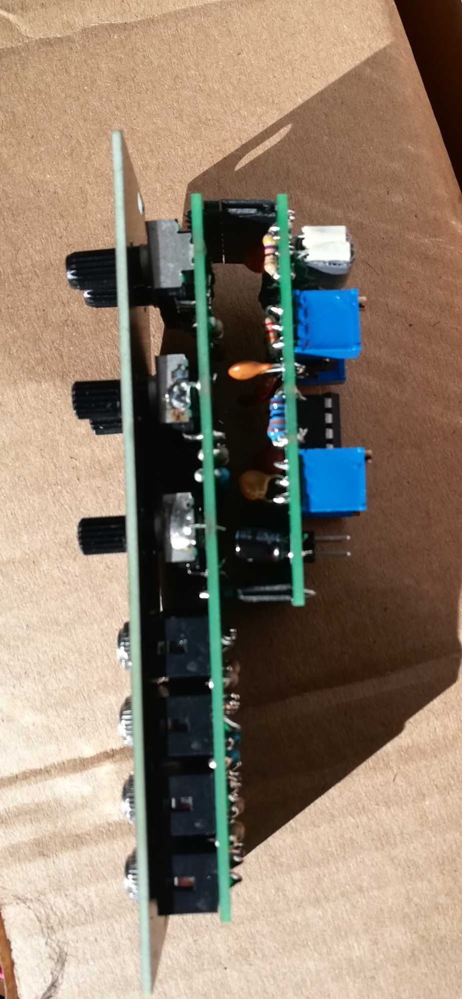

# Hagiwo Eurorack Dual Lin-Exp VCA

This project is a through hole PCB version the HAGIWO 055 dual veils-style VCA. I added a second CV in. 

## STATUS: CONFIRMED WORKING

## Hardware and PCB
this had to be 2 PCBs and 8HP (its hard to make it smaller without making it SMT), but I think i managed to get it very tidy.

You can find the schematic and BOM in the root folder. 
As mentioned, the module has one circuit PCB and one panel PCB. 

You can order them on any common PCB manufacturing service, I used JLCPCB. For the circuit PCB, standard settings should be fine.
For the panel, since it has copper exposed, make sure to choose a lead free surface finish (LeadFree HASL, ENIG) and/or spraypaint your panels so that you don't get lead on your hands.

  

Assembly is fairly straight forward, just use the componentent values.
The VCA is built for ~5V cv interval, if you with to use a bigger interval, try replacing the circled 10K resistors with different values.

 
